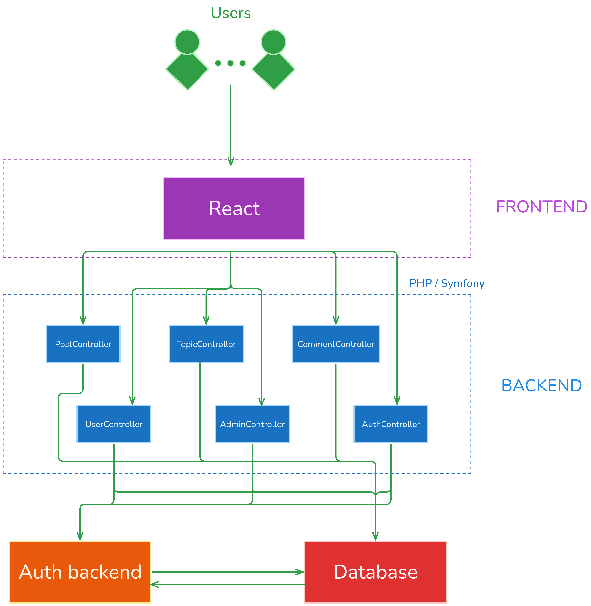
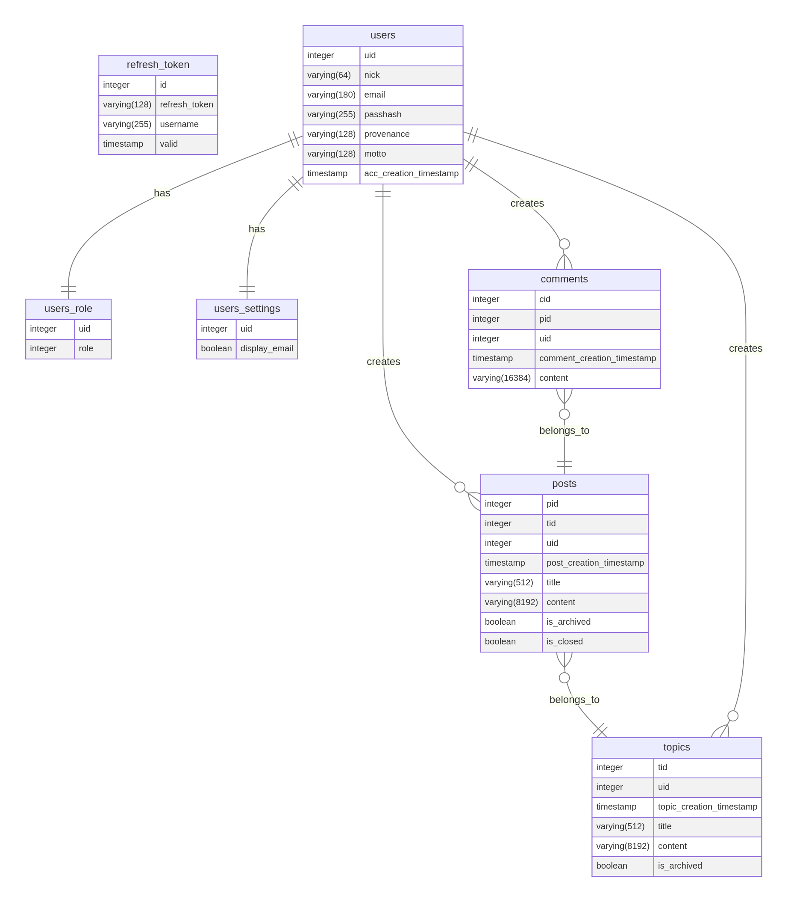

# Opis
Projekt na __Zaawansowane Technologie Projektowania Aplikacji Internetowych__.
Jest to forum internetowe dotyczące fizyki. Użytkownicy mogą zakładać konta, tworzyć nowe wątki i na nie odpowiadać. Nad tym wszystkim czywają administratorzy.

Projekt dzieli się na dwie zasadnicze części: frontend zbudowany w Reactie, oraz backend zbudowany za pomocą PHP/Symfony. Za obsługę wymagań bazodanowych dba Postgresql, uruchomiony w osobnym kontenerze Dockera. Skonfigurowany jest też nginx.

# Funkcjonalności
- Logowanie za pomocą JWT i refresh token,
- Rozróżnianie między użytkownikiem anonimowym, zalogowanym i administratorem,
- Wyświetlanie, tworzenie i usuwanie postów i komentarzy,
- Usuwanie użytkowników,
- Backend w pełni skonfigurowany pod obsługę REST API
- Stronicowane endpointy
- Responsywny design

# Wykorzystane technologie
- __PHP / Symfony__: Dojrzały i w pełni wyposażony zbiór narzędzi do implementacji backendu,
- __Doctrine__: Pozwala na wykorzystanie ORM i DBAL,
- __React__: Popularna i obszerna biblioteka pozwalająca budować piękne, responsywne aplikacje internetowe,
- __Tailwind__: Umożliwia stylowanie elementów wizualnych bzepośrednio w strukturze frontu bez nadkładu CSS,
- __Postgresql__: Lider rozwiązań bazodanowych, pozwalający na niezrównanie szybki dostęp do SQL,
- __Nginx__: Wydajny, otwartoźródłowy projekt serwera http/www.


# Struktura repozytorium
```
ztpai-project-repo/
├─ app/            # źródła PHP (Symfony)
│  ├─ config/      # konfiguracja backendu oraz jego usług
│  ├─ src/
│  │  ├─ Controller    # kontrolery odpowiadające za endpointy w API
│  │  ├─ Database      # helpery do interakcji z bazą danych
│  │  ├─ DataFixtures  # generator danych testowych
│  │  ├─ Entity        # ORM
│  │  ├─ EventListener # nadpisywanie domyślnych odpowiedzi wbudowanych usług
│  │  ├─ Message       # struktura wiadomości do przesyłania za pomocą RabbitMQ
│  │  ├─ Repository    # nakładka na ORM, umożliwiająca hotwiring
│  │  ├─ Security      # nadpisywanie odpowiedzi ściany ogniowej
│  │  └─ Service       # zbiór wyekstraktowanych serwisów
│  └─ tests/       # testy jednostkowe i funkcjonalne
├─ docker/         # pliki Dockerfile i docker‑compose.yml
│  ├─ nginx/
│  ├─ php/
│  └─ mysql/
├─ react/          # aplikacja React, Vite + Tailwind
│  ├─ src/
│  └─ vite.config.ts
└─ README.md       # opis projektu
```

# Schemat architektury


# Struktura bazy danych


# Instrukcja uruchomienia
## 1. Pobierz repozytorium lokalnie
```bash
git clone https://github.com/AMDevRadeon/ztpai-project-repo.git
cd ztpai-project-demo
```

## 2. Zbuduj kontenery Docker
```bash
docker compose up --build -d
```

## 3. Zaaplikuj migracje
```bash
docker exec -it postgresql-ztpai sh
php bin/console doctrine:schema:drop --force
php bin/console doctrine:migrations:migrate
```

## 4. Utwórz parę kluczy do szyfrowania
```bash
docker exec -it postgresql-ztpai sh
php bin/console lexik:jwt:generate-keypair
```

## 5. Uruchom kolejkę RabbitMQ
```bash
docker exec -it postgresql-ztpai sh
php bin/console messenger:consume async -vv
```

## 6. Przygotuj frontend
```bash
npm install
npm run dev
```

## 7. Dostęp
- Frontend: http://localhost:5137
- Backend: http://localhost:8080/api

> [!NOTE]
> Aby przygotować środowisko testowe, wykonaj następujące czynności:
> ```bash
> docker exec -it postgresql-ztpai sh
> php bin/console --env=test doctrine:schema:drop --force
> php bin/console --env=test doctrine:schema:create
> php bin/console --env=test doctrine:fixtures:load --no-interaction
> ```
